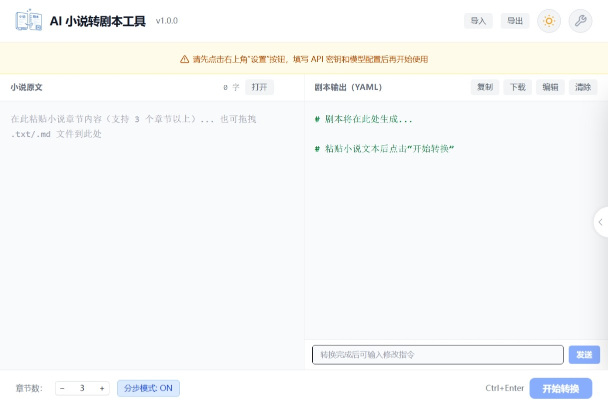
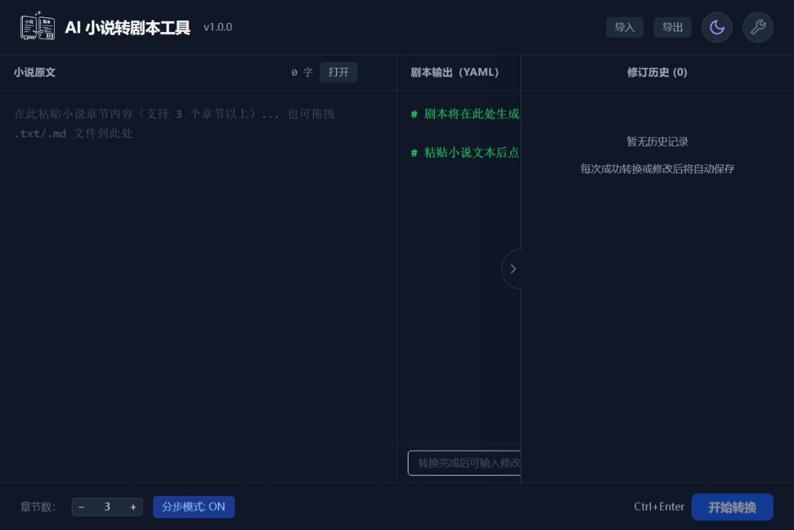

<div align="center">

# 📝 AI 小说转剧本工具

*将小说文本智能转换为影视工业化 YAML 剧本*

</div>

## 📖 简介

本工具能够将小说章节文本自动转换为结构化的 YAML 格式剧本，覆盖人物表、场景切分、对白提取、镜头语言、灯光设计、情绪弧线等专业维度。支持单次转换与多步 Pipeline 两种模式，适配 DeepSeek、阿里云百炼等兼容 OpenAI 接口的大模型服务。

## 🎥 演示视频

> [🔗 观看演示视频](https://pan.baidu.com/s/1SKxRure-hvYOpSiRA_FQnw?pwd=pi4y) 提取码: pi4y

## 📸 界面预览

<div align="center">
  
  &nbsp;
  
</div>

## ✨ 核心功能

- **双模式转换引擎**：单次转换（快速直出）与分步 Pipeline（人物提取 → 场景切分 → 剧本生成），兼顾效率与质量
- **LUI 自然语言编辑**：无需手动修改 YAML，用自然语言描述修改意图，AI 自动精调剧本
- **版本历史管理**：每次转换/编辑自动存档，支持回溯、对比、删除任意历史版本
- **一键导入/导出**：将所有状态（原文、剧本、历史记录）打包为单个文件，支持跨会话恢复
- **多模型适配**：内置设置面板，支持自定义 Base URL、API Key、各步骤模型及 Token 上限，兼容任意 OpenAI 接口服务
- **亮色/暗色主题**：一键切换，适配不同使用环境
- **文件导入**：支持从 `.txt`、`.md` 文件直接打开小说文本
- **YAML 语法高亮**：输出区自动高亮，提升可读性
- **输入校验**：自动检测非小说内容并给出警告提示

## 🎬 YAML 剧本 Schema

输出格式严格遵循[影视工业化 Schema 设计文档](docs/schema_design.md)，核心设计理念：

- **时间线驱动**：action / dialogue / voiceover 在同一列表中交替，忠实还原叙事节奏
- **面向影视工业**：包含镜头语言（camera）、灯光（lighting）、情绪弧线（emotional_arc）
- **角色别名映射**：自动识别昵称、外号、敬称，统一映射到同一角色
- **改编建议**：adaptation_notes 提供节奏分析、BGM 建议、缺失上下文标注

## 🏗️ 技术架构

```
┌─────────────────────────────────────────────────────┐
│               前端 (React + TypeScript)             │
│  ┌──────────┐  ┌──────────┐  ┌───────────────────┐  │
│  │ 小说输入  │  │ LUI 编辑 │  │ 剧本输出 (YAML)    │  │
│  └──────────┘  └──────────┘  └───────────────────┘  │
│         │              │               │            │
│  ┌──────┴──────────────┴───────────────┴──────────┐ │
│  │          状态管理 (History + Settings)          │ │
│  └──────────────────────┬─────────────────────────┘ │
│                         │                           │
│  ┌──────────────────────┴─────────────────────────┐ │
│  │        转换引擎 (convert.ts / pipeline/)        │ │
│  │   单次模式 ────→ API ────→ YAML                 │ │
│  │   Pipeline ──→ 人物提取 ──→ 场景切分 ──→ 组装    │ │
│  └──────────────────────┬─────────────────────────┘ │
└─────────────────────────┼───────────────────────────┘
                          │
                   ┌──────┴──────┐
                   │  LLM API    │
                   │ (DeepSeek / │
                   │  阿里云百炼 /│
                   │  兼容服务)   │
                   └─────────────┘
```

## 🚀 快速开始

```bash
# 克隆仓库
git clone https://github.com/Carlo-Chan/novel-to-script-ai
cd novel-to-script-ai

# 安装依赖
npm install

# 启动开发服务器
npm run dev
```

首次使用请在设置面板（右上角设置图标）中填入 API Key，支持 DeepSeek、阿里云百炼及任意兼容 OpenAI Chat Completions 接口的服务。

## 📁 项目结构

```
├── docs/
│   ├── schema_design.md        # YAML Schema 设计文档
│   └── example_script.yaml     # 示例剧本输出
├── src/
│   ├── components/
│   │   ├── ConfirmDialog.tsx   # 确认弹窗组件
│   │   ├── HistoryPanel.tsx    # 历史版本面板
│   │   └── SettingsDialog.tsx  # 设置面板
│   ├── hooks/
│   │   ├── useHistory.ts       # 历史记录状态管理
│   │   └── useTheme.ts         # 主题切换
│   ├── lib/
│   │   ├── convert.ts          # 单次转换引擎
│   │   ├── refine.ts           # LUI 编辑引擎
│   │   └── settings.ts         # 设置持久化
│   ├── pipeline/
│   │   └── index.ts            # 多步 Pipeline 引擎
│   ├── assets/                 # 图标资源
│   ├── App.tsx                 # 主应用组件
│   ├── index.css               # 全局样式
│   └── main.tsx                # 入口文件
├── index.html
├── package.json
├── vite.config.ts
└── README.md
```

## 🔧 技术栈

| 层级 | 技术选型 |
|------|---------|
| 前端框架 | React 19 + TypeScript |
| 样式方案 | TailwindCSS 4 |
| 构建工具 | Vite 6 |
| AI 引擎 | DeepSeek API / 阿里云百炼 / 兼容 OpenAI 接口 |
| 输出格式 | YAML 1.2（js-yaml 解析） |
| 数据持久化 | localStorage（设置 / 状态导入导出） |

## 🛠️ 工程规范与协作

本项目在 72 小时开发周期内严格贯彻企业级工程协作标准：

- **细粒度 PR 驱动**：拒绝「单分支一把梭」和「临尾突击」，所有功能（Schema 设计、UI 搭建、Pipeline 引擎、LUI 编辑、主题切换、解耦重构等）均拆分为独立分支开发，累计合并 20 个规范化 PR
- **语义化提交**：严格遵循 `feat:`、`fix:`、`style:`、`docs:`、`refactor:` 等标准 Commit 格式，PR 描述完整包含功能描述、实现思路、测试方式
- **解耦架构**：API 请求层（`lib/`）、状态管理（`hooks/`）与 UI 渲染（`components/`）严格分离，保证代码健壮性与可维护性

## 🚀 未来规划

在 72 小时的极限开发中，我们优先保证了核心 Pipeline 的稳定性与交互的完备性。以下方向已在架构层面预留扩展空间：

- **Schema-as-a-Service（自定义模板引擎）**：系统提示词已与业务逻辑解耦，未来可开放自定义 Schema 库，内置「好莱坞标准剧本」「剧本杀 DM 手册」「动漫分镜台本」等预设模板
- **多 Agent 协同审校**：在 Pipeline 末端引入审校 Agent，自动检测角色台词冲突、节奏问题并给出修改建议
- **批量处理**：支持多篇小说/多章节的批量导入与排队转换
- **导出格式扩展**：支持 PDF、Final Draft (.fdx) 等专业剧本格式导出

## 📄 License

MIT
